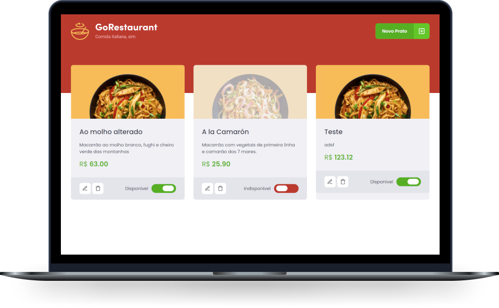

<h1 align="center">
  <a href="https://www.linkedin.com/in/kesleydavid/" target="_blank">
    
  </a>
</h1>

<p align="center">
  <a href="#">
    
  </a>
  <h3 align="center">GoRestaurant</h3>
</p>

<p align="center">
  <a href="#-preview">Preview</a>&nbsp;&nbsp;&nbsp;|&nbsp;&nbsp;&nbsp;
  <a href="#-project">Project</a>&nbsp;&nbsp;&nbsp;|&nbsp;&nbsp;&nbsp;
  <a href="#-next-level">Next Level</a>&nbsp;&nbsp;&nbsp;|&nbsp;&nbsp;&nbsp;
  <a href="#-technologies">Technologies</a>&nbsp;&nbsp;&nbsp;|&nbsp;&nbsp;&nbsp;
  <a href="#-getting-started">Getting started</a>&nbsp;&nbsp;&nbsp;|&nbsp;&nbsp;&nbsp;
  <a href="#-tests">Tests</a>&nbsp;&nbsp;&nbsp;|&nbsp;&nbsp;&nbsp;
  <a href="#-movie">Movie</a>&nbsp;&nbsp;&nbsp;|&nbsp;&nbsp;&nbsp;
  <a href="#-license">License</a>
</p>

<p align="center">

  <a href="#">
    
  </a>

  <a href="https://www.linkedin.com/in/kesleydavid/" target="_blank">
    
  </a>

  <a href="https://study-ignite-react-challenge-02-02.vercel.app/" target="_blank">
    
  </a>

  <a href="#">
    
  </a>

  <a href="#">
      
  </a>

  <a href="#">
    
  </a>

  <a href="./LICENSE">
    
  </a>

</p>

<p align="center">
    
</p>

<hr>

## ✨ Preview

System Online  
[https://study-ignite-react-challenge-02-02.vercel.app](https://study-ignite-react-challenge-02-02.vercel.app//)  

## 💻 Project

In this challenge, you will have to create an application to train what you have learned so far at ReactJS.  

This will be an already functional application where its main objective is to perform two migration processes: from Javascript to Typescript and from Class Components to Function Components.  
  
This is a project developed during the **[Ignite - Trilha React](https://rocketseat.com.br/)**, carried out by **[@Rocketseat](https://github.com/Rocketseat)**.

## 💎 Next Level

```bash
  # Coming soon
```

## 🔖 Technologies

This project was developed using the following technologies:

- [React](https://reactjs.org)
- [TypeScript](https://www.typescriptlang.org/)
- [JSON-server](https://github.com/typicode/json-server)
- [Styled-Components](https://styled-components.com/)
- [Axios](https://github.com/axios/axios)
- [Unform](https://unform.dev/)

## 🚀 Getting started

Clone the project

```bash
$ git clone https://github.com/KesleyDavid/study_Ignite_React_Challenge-02-02.git
```

Access the folder
```bash
$ cd study_Ignite_React_Challenge-02-02
```

Follow the steps below
```bash
# Install the dependencies
$ yarn

# Start the server (backend)
$ yarn server

# Start the web (frontend)
$ yarn dev
```

## 🥇 Tests

```bash
  # Coming soon
```

<!-- Run tests
```bash
$ yarn test
```

 -->

## 🎬 Movie


## 📝 License

This project is licensed under the MIT License. See the [LICENSE](LICENSE) file for details.


---

<p align="center">Made with ♥ by <a href="https://www.linkedin.com/in/kesleydavid/" target="_blank">Kesley DEV</a></p>